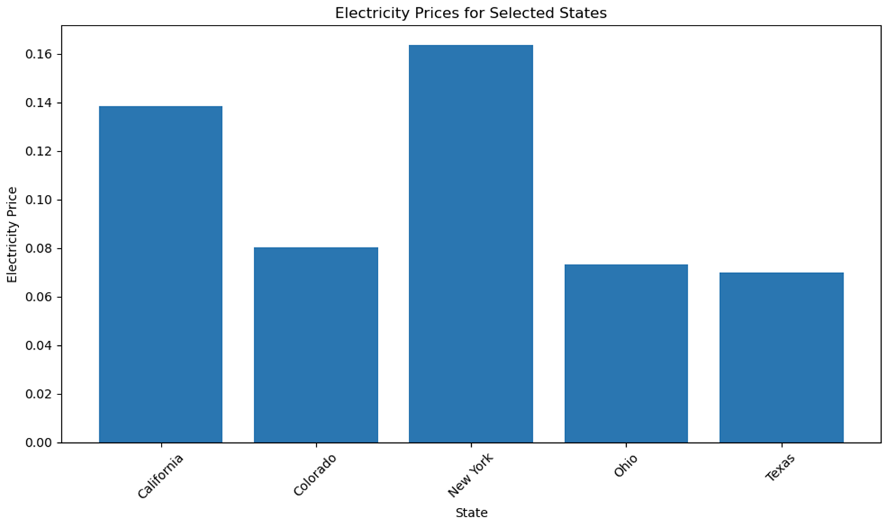

# Internal Combustion Engine (ICE) Vehicles vs Electric Vehicles (EVs)

This project was focused on the data exploration and cleanup process of data related to ICE and EVs. Pandas was used to clean and format a number of datasets. And the analysis process itself was accompanied by Jupyter notebooks along with visualizations of the data using Matplotlib. A summary presentation with key questions and conclusions was also produced.

## Group Members

Lindsay Robbins, Cassandra Wyatt, Jerry Youngblood, and Mitchell Ryan

## Project Description

Analyzing the pros/cons of owning an EV vs an ICE vehicle

## Research Questions to be Answered

- What is the current trend in vehicle registrations?
- What is the carbon footprint of ICE vs EVs?
- Which fuel type is more cost-efficient?
- What are the key considerations for charging an EV?

## Datasets to be Used

- <https://developer.edmunds.com/api-documentation/vehicle/>
- <https://www.carmd.com/api/vehicle-maintenance-carmd-api/>
- <https://data.bls.gov/timeseries/APU000072610?amp%253bdata_tool=XGtable&output_view=data&include_graphs=true>
- <https://www.carboninterface.com/vehicles>
- <https://afdc.energy.gov/vehicles/electric_emissions.html>
- <https://afdc.energy.gov/vehicle-registration>
- <https://zylalabs.com/api-marketplace/tools/carbon+footprint+tracker+api/1015>
- <https://afdc.energy.gov/calc/cost_calculator_methodology.html#sources>
- <https://developers.enode.com/api/reference#introduction>
- <https://www.eia.gov/dnav/pet/pet_pri_gnd_a_epm0_pte_dpgal_w.htm>

## Conclusions

- What is the current trend in vehicle registrations?
EV, plug-in hybrid electric (PHEV), and hybrid electric vehicle (HEV) registrations have increased about 20-25% year-over-year in the last three years and risen overall by 52% from 2020 through 2022. HEVs continue to make up the majority of electric vehicles registered. However, fully electric vehicle registrations more than doubled from 2020 to 2022.

- What is the carbon footprint of ICE vs EVs?
There are many factors to be considered when determining the total life cycle GHG emissions of an EV, PHEV, or HEV. Although those vehicles produce zero tailpipe GHG emissions when running on 100% electricity, the source of electricity used to charge the vehicle - as well as all the aspects of production of the vehicle - should be considered. Overall, gasoline-powered vehicles produce less emissions than EVs during initial production but more emissions during the overall life cycle of the vehicle.

- Which fuel type is more cost-efficient?
Prices shown over the years for electricity as fuel have been steady, but gas prices are not as consistent given that the price of gas can always fluctuate. Even with the gallon-equivalent of electricity being higher than gas, electricity is still less expensive overall because the amount of electricity needed for EV is less than gallons of gas needed for ICE vehicles.

- What are the key considerations for charging an EV?
